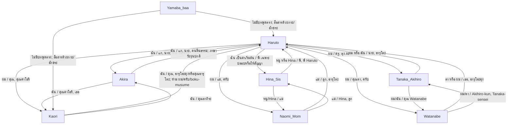

# คู่มือข้อมูลตัวละครและคลังเสียงวรรณกรรม (Tsukinomi Character Bible & Voice Guide)

> [!IMPORTANT]
> **กฎเหล็กแห่งวรรณกรรม (Golden Rule of Literary Tone)**: 
> ตัวละครทุกตัวใน *Tsukinomi no Eki* (สถานีทะเลพระจันทร์) ต้องไม่ลอยอยู่อย่างนิ่งเฉย ทุกคนมีปฏิสัมพันธ์และการเติบโต (Character Evolution) ผ่านสภาพแวดล้อมและช่วงเวลาอย่างมีชีวิตชีวา 
> ห้ามใช้สรรพนามและน้ำเสียงที่เป็นทางการทื่อๆ (เช่น การใช้คำว่า "ครับ" ระหว่างเพื่อนสนิท หรือการใช้คำว่า "ครับ" ของพี่ชายที่พูดกับน้องสาว ม.1) เพราะจะทำลายบรรยากาศความเป็นมิตรภาพและทำลายมิติของครอบครัวโดยสิ้นเชิง
> 
> **ตรวจหลักฐานล่าสุดแล้ว**: character asset จริงมี 8 ภาพ ได้แก่ Haruto, Kaori, Hina, Akira, Naomi, Tanaka Akihiro, Watanabe และ Yamaba-baa ดังนั้นคู่มือนี้ต้องครอบคลุมเสียงของทั้ง 8 ตัว ไม่ใช่มีแต่คู่ที่ Haruto คุยด้วย
>
> **Kaori Voice Lock**: Mizushima Kaori ไม่ใช่ boku-musume. เธอเป็นวิญญาณเด็กสาวลึกลับ อ่อนโยน มีเสน่ห์ และพูดน้อย จึงแทนตัวเองว่า **"ฉัน"** เป็นหลัก ใช้ **"ค่ะ/คะ/นะคะ"** อย่างประหยัดตามจังหวะอ่อนโยน ห้ามให้ Kaori แทนตัวเองว่า **"ผม"** หรือใช้ **"ครับ"** เด็ดขาด เว้นแต่ผู้เขียนสั่งทดลอง rewrite เสียงใหม่แบบระบุชัดเท่านั้น

---

## 1. ผังสายสัมพันธ์และสำเนียงการพูด (Relationship & Dialogue Accent Matrix)

เพื่อให้สอดคล้องกับธรรมชาติของวัยรุ่นญี่ปุ่นและสไตล์การเขียนของไลท์โนเวลระดับพรีเมียม สรรพนามและหางเสียงระหว่างคู่ตัวละครต้องได้รับการควบคุมอย่างเข้มงวดดังนี้:



### 1.1 Takahashi Haruto (高橋 陽翔) $\leftrightarrow$ Suzuki Akira (鈴木 晃)
*   **ประเภทสายสัมพันธ์**: เพื่อนสนิทร่วมชั้นเรียน ม.6 (Classmates / Best Friends) ที่คอยระวังหลังและยอมเสี่ยงเพื่อกันและกัน (มิตรภาพลูกผู้ชายแบบสหายแท้ ไม่มีความเป็น BL เชิงชู้สาว)
*   **สำเนียงและสรรพนามของ Haruto พูดกับ Akira**:
    *   **สรรพนาม**: แทนตัวเองว่า **"ฉัน"** เรียกอากิระว่า **"แก"** หรือ **"นาย"**
    *   **หางเสียง/คำลงท้าย**: ใช้คำลงท้ายปกติของวัยรุ่นสนิทกัน เช่น **"ว่ะ" / "นะเว้ย" / "หรอก" / "ล่ะ"** แต่ไม่ต้องยัดคำหยาบทุกประโยค เพราะความสนิทควรฟังเป็นธรรมชาติ ไม่ใช่พยายามแมน
    *   **กฎเหล็ก**: **ห้ามใช้คำว่า "ครับ" หรือ "ผม" ในบทสนทนากับอากิระเด็ดขาด!** (ยกเว้นกรณีที่แกล้งพูดประชดตลกๆ)
    *   *คำแก้ตัวอย่างทื่อ*: "อรุณสวัสดิ์ครับ Akira" $\rightarrow$ **"อรุณสวัสดิ์ อากิระ"** หรือ **"ไง อากิระ"**
    *   *คำแก้ตัวอย่างทื่อ*: "นี่นายคิดจะเอาจริงงั้นเหรอครับ?" $\rightarrow$ **"นี่แกเอาจริงเหรอวะ?"** หรือ **"เอาจริงดิ อากิระ?"**
*   **สำเนียงและสรรพนามของ Akira พูดกับ Haruto**:
    *   **สรรพนาม**: แทนตัวเองว่า **"ฉัน"** เรียกฮารุโตะว่า **"แก"**, **"นาย"** หรือฉายาประชดว่า **"คนตื่นธรรม"**
    *   **หางเสียง/คำลงท้าย**: พูดเร็ว ทะเล้นแต่จริงใจ ใช้คำว่า **"วะ" / "นะเว้ย" / "ฟะ" / "ดิ"** เมื่อจังหวะต้องการ ไม่ใช่สุภาพแบบงานราชการ
    *   **กฎเหล็ก**: อากิระเป็นโอตาคุที่พูดเหมือนเด็กผู้ชายปกติที่สนิทกับเพื่อนมาก ห้ามให้เขาพูดสุภาพเรียบร้อยแบบหุ่นยนต์ หรือพูดหวานจนดูเป็น BL
    *   *คำแก้ตัวอย่างทื่อ*: "ของเล่นของ Yumeiro Saga เกมที่ผมเล่าให้ฟัง" $\rightarrow$ **"เกม Yumeiro Saga ที่ฉันเคยเล่าให้แกฟังไง"**

### 1.2 Takahashi Haruto $\leftrightarrow$ น้องสาว Hina (高橋 陽菜)
*   **ประเภทสายสัมพันธ์**: พี่ชาย ม.6 ผู้เงียบขรึมกับน้องสาว ม.1 ผู้สดใสและมีสัมผัสพิเศษที่พยายามเติมเต็มรอยร้าวในบ้านหลังพ่อเสียชีวิต
*   **สำเนียงและสรรพนามของ Haruto พูดกับ Hina**:
    *   **สรรพนาม**: แทนตัวเองว่า **"ฉัน"** เป็นค่าเริ่มต้นเมื่อคุยกันแบบพี่น้องในบ้าน และใช้ **"พี่"** เฉพาะจังหวะปลอบใจ ให้สัญญา หรือปกป้องจริงๆ เรียกฮินะว่า **"Hina"** หรือ **"ฮินะ"**
    *   **หางเสียง/คำลงท้าย**: อบอุ่น แต่ต้องเป็นภาษาเด็ก ม.6 ที่พูดกับน้อง ไม่ใช่ภาษาอาผู้ใหญ่หวานทื่อ ใช้ **"อืม" / "ละ" / "นะ" / "หรอก"** เป็นหลัก และใช้ **"จ๊ะ/นะจ๊ะ"** ให้น้อยมาก เฉพาะจังหวะหยอกหรือปลอบเบาๆ
    *   **กฎเหล็ก**: **ห้ามใช้คำว่า "ครับ" กับน้องสาวเด็ดขาด!** และห้ามยัด **"นะจ๊ะ"** ทุกประโยค เพราะจะทำให้ Haruto ดูแก่และไม่เป็นธรรมชาติ
    *   *คำแก้ตัวอย่างทื่อ*: Hina: "คืนนี้?" $\rightarrow$ Haruto: "...ครับ" $\rightarrow$ **เปลี่ยนเป็น: "...อืม คืนนี้แหละ"** หรือ **"...ใช่ คืนนี้"**
    *   *คำแก้ตัวอย่างทื่อ*: Haruto: "เราเพิ่งอยู่ ม.1 เองนะ แม่ไม่มีทางยอมให้ไปหรอกครับ" $\rightarrow$ **เปลี่ยนเป็น: "Hina เพิ่งอยู่ ม.1 เองนะ แม่ไม่ยอมให้ขึ้นไปหรอก"**
    *   *จังหวะให้สัญญา*: "ผมจะไม่ลืม Hina" $\rightarrow$ **"ฉันจะไม่ลืม Hina"** หรือถ้าต้องการน้ำเสียงพี่ชายชัดขึ้น **"พี่จะไม่ลืมฮินะ"**
*   **สำเนียงและสรรพนามของ Hina พูดกับ Haruto**:
    *   **สรรพนาม**: แทนตัวเองว่า **"หนู"** หรือ **"Hina"** เรียกฮารุโตะว่า **"พี่"**, **"พี่ Haruto"** หรือเวลาขี้อ้อนหยอกล้อจะเรียกว่า **"พี่จ๋า"**
    *   **หางเสียง/คำลงท้าย**: สดใส ขี้อ้อน ช่างจดช่างจำ แต่แฝงความกังวลลึกๆ ลงท้ายด้วย **"ค่ะ" / "นะคะ" / "จ๋า"** ได้เมื่อเหมาะกับจังหวะเด็ก ม.1

### 1.3 Takahashi Haruto $\leftrightarrow$ แม่ Naomi (高橋 直美)
*   **ประเภทสายสัมพันธ์**: ลูกชายคนโตผู้รับผิดชอบกับแม่เลี้ยงเดี่ยวที่พยายามทำงานหาเลี้ยงครอบครัว
*   **สำเนียงและสรรพนามของ Haruto พูดกับแม่**:
    *   **สรรพนาม**: แทนตัวเองว่า **"ผม"** เรียกแม่ว่า **"แม่"** หรือ **"คุณแม่"**
    *   **หางเสียง/คำลงท้าย**: สุภาพ อ่อนโยน มีระยะห่างที่แสดงความเกรงใจ ใช้ **"ครับ"** เสมอ
*   **สำเนียงและสรรพนามของแม่ Naomi พูดกับ Haruto**:
    *   **สรรพนาม**: แทนตัวเองว่า **"แม่"** เรียกฮารุโตะว่า **"ฮารุโตะ"** หรือ **"ลูก"**
    *   **หางเสียง/คำลงท้าย**: อบอุ่น อ่อนโยน ปนน้ำเสียงเหนื่อยล้าจากการทำงานแห้ง ลงท้ายด้วย **"จ๊ะ" / "นะจ๊ะ" / "นะลูก"**
    *   *คำแก้ตัวอย่างทื่อ*: "เสวนารับประทานอาหารค่ำ อย่าลืมกลับมารับประ�### 1.11 ผังสายสัมพันธ์และคำเรียกขานเมื่อสนทนากลุ่มหลายคน (Group & Multi-Person Dialogue Matrix)

เมื่อเรื่องราวมีฉากสนทนาที่ก้าวข้ามการคุยแบบ 2 คน (เช่น อยู่ร่วมกัน 3 คนขึ้นไปในห้องรับแขก ตลาดเช้า หรือการปีนเขา) ระดับของน้ำเสียง สรรพนาม และระยะห่างในการเรียกจะขยับตัวอย่างเป็นพลวัตตามบุคคลที่ยืนร่วมอยู่ในบทสนทนา:
*   **Hina $\leftrightarrow$ Akira (น้องสาวเพื่อนสนิท / พี่ชายเพื่อน)**:
    *   **อากิระ เรียก ฮินะ**: เรียก **`ฮินะจัง`** (Hina-chan) หรือ **`น้องฮินะ`** แทนตัวเองว่า **`ฉัน`** หรือ **`พี่`** (เมื่อต้องการปลอบใจหรือปกป้องน้อง) ใช้หางเสียงที่สุภาพปนอบอุ่นและมีจังหวะขี้เล่นแบบพี่ชายเพื่อนที่เกรงใจครอบครัว ไม่หยาบคายเหมือนคุยกับฮารุโตะ
    *   **ฮินะ เรียก อากิระ**: เรียก **`พี่อากิระ`** หรือ **`พี่ Akira`** แทนตัวเองว่า **`หนู`** หรือ **`Hina`**
*   **Akira $\leftrightarrow$ แม่ Naomi (เพื่อนสนิทของลูก / แม่เพื่อน)**:
    *   **อากิระ เรียก นาโอมิ**: เรียก **`คุณน้า`** หรือ **`คุณแม่ฮารุโตะ`** หรือ **`น้านาโอมิ`** แทนตัวเองว่า **`ผม`** ลงท้ายด้วยคำว่า **`ครับ`** เสมอ เพื่อแสดงความเกรงใจและเคารพต่อผู้ใหญ่
    *   **นาโอมิ เรียก อากิระ**: เรียก **`อากิระ`** หรือ **`อากิระคุง`** แทนตัวเองว่า **`น้า`** หรือ **`แม่`** (ในจังหวะที่อบอุ่นและเอ็นดูเพื่อนลูก) ลงท้ายด้วย **`จ้ะ/จ๊ะ`**
*   **Tanaka Akihiro $\leftrightarrow$ แม่ Naomi (น้องสะใภ้ / พี่สะใภ้ผู้สูญเสียสามี)**:
    *   เนื่องจากครู Tanaka เป็นน้องชายแท้ๆ ของคุณพ่อ Daichi ความเกรงอกเกรงใจและความโศกเศร้าในอดีตทำให้คู่นี้พูดคุยกันด้วยระยะห่างที่เปี่ยมด้วยความเคารพ:
    *   **ครู Tanaka เรียก นาโอมิ**: เรียก **`พี่สะใภ้นาโอมิ`** หรือ **`คุณนาโอมิ`** แทนตัวเองว่า **`ผม`** ลงท้ายด้วยความสุภาพอย่างสูง
    *   **นาโอมิ เรียก ครู Tanaka**: เรียก **`คุณ Akihiro`** หรือ **`คุณครู Tanaka`** (เมื่อพูดในพื้นที่ของโรงเรียน) แทนตัวเองว่า **`พี่`** หรือ **`ฉัน`**
*   **ครู Tanaka $\leftrightarrow$ Akira (ครูพละ / นักเรียน ม.6)**:
    *   **ครู Tanaka เรียก อากิระ**: เรียก **`Suzuki`** หรือ **`อากิระ`** (เสียงเข้ม สั่งการในคาบเรียนแบบครูพละทหาร) แทนตัวเองว่า **`ครู`** หรือ **`ผม`**
    *   **อากิระ เรียก ครู Tanaka**: เรียก **`ครู Tanaka`** (Tanaka-sensei) แทนตัวเองว่า **`ผม`** ลงท้ายด้วย **`ครับ`**
*   **ครู Tanaka $\leftrightarrow$ Hina (ครู/ลุงของหลานสาว ม.1)**:
    *   **ครู Tanaka เรียก ฮินะ**: เรียก **`ฮินะ`** หรือ **`หลาน`** (เมื่อสนทนากันเป็นส่วนตัวในครอบครัว) แทนตัวเองว่า **`ลุง`** หรือ **`ผม`** น้ำเสียงใจดี อบอุ่น มีความรับผิดชอบ
    *   **ฮินะ เรียก ครู Tanaka**: เรียก **`คุณครู Tanaka`** หรือ **`คุณลุง Akihiro`** แทนตัวเองว่า **`หนู`**
*   **Watanabe (ผู้ดูแลศาลเจ้า) $\leftrightarrow$ ตัวละครอื่นๆ**:
    *   **Watanabe เรียก Hina**: เรียก **`หนู`** หรือ **`ฮินะจัง`**
    *   **Watanabe เรียก Akira**: เรียก **`Suzuki-kun`** หรือ **`พ่อหนุ่ม`** ด้วยความเอ็นดูเหมือนตาคุยกับหลาน
    *   **Watanabe เรียก Naomi**: เรียก **`Naomi-san`** หรือ **`คุณแม่`** เพื่อให้เกียรติในฐานะหัวหน้าครอบครัว

---

### 1.12 กฎระดับลึกและพฤติกรรมคำเรียกเฉพาะในกลุ่ม (Deep Multi-Character Dynamic & Addressing Blueprint)

เพื่อป้องกันไม่ให้บทสนทนาในฉากที่มีคนมากกว่า 2 คนดูทื่อ ไร้มิติ หรือสูญเสียระดับความสัมพันธ์ ให้บังคับใช้กฎคำเรียกขานและพฤติกรรมต่อไปนี้อย่างเคร่งครัด:

#### 1. การเรียกพี่ชายของ Hina (Takahashi Hina $\rightarrow$ Haruto)
*   **เมื่ออยู่กันตามลำพัง (Alone/Intimate)**:
    *   ฮินะแทนตัวเองว่า **"หนู"** หรือ **"Hina"** และเรียกฮารุโตะว่า **"พี่"** หรือ **"พี่ Haruto"**
    *   ในฉากขี้อ้อนล้อเลียนหรือต้องการขอร้องเป็นพิเศษ สามารถใช้คำว่า **"พี่จ๋า"** หรือ **"พี่ฮารุโตะสุดหล่อ"** ได้เพื่อสร้างบรรยากาศสดใสร่าเริงของเด็ก ม.1
*   **เมื่ออยู่ต่อหน้าแม่ Naomi (In front of Mom)**:
    *   ฮินะจะเปลี่ยนมาเรียกฮารุโตะว่า **"พี่ฮารุโตะ"** หรือ **"พี่"** อย่างเรียบร้อยและกึ่งเป็นทางการขึ้นเล็กน้อย เพื่อรักษาความเป็นระเบียบและหลีกเลี่ยงการโดนแม่ดุเรื่องทำตัวเป็นเด็กไร้สาระ
*   **เมื่ออยู่ต่อหน้า Akira (In front of Akira)**:
    *   ฮินะจะเรียกฮารุโตะว่า **"พี่ฮารุโตะ"** หรือ **"พี่"** อย่างจริงจังและกึ่งปกป้องพี่ชายตนเอง (เช่น เวลาอากิระแซวฮารุโตะว่า "คนตื่นธรรม" ฮินะจะค้อนใส่และพูดปกป้องว่า *"พี่ฮารุโตะไม่ได้เป็นแบบนั้นสักหน่อยนะคะ พี่อากิระ!"*)
    *   ฮินะจะ **ห้ามใช้คำว่า "พี่จ๋า" ต่อหน้าอากิระเด็ดขาด** เนื่องจากความเขินอายและต้องการวางตัวเป็นน้องสาวที่โตพอสมควรในสายตาเพื่อนพี่ชาย
*   **เมื่ออยู่ต่อหน้าผู้ใหญ่ท่านอื่น (Tanaka หรือ Watanabe)**:
    *   ฮินะจะใช้มารยาทแบบเด็กญี่ปุ่นอย่างเคร่งครัด เรียกฮารุโตะว่า **"พี่ฮารุโตะ"** ด้วยน้ำเสียงอ่อนน้อมถ่อมตน

#### 2. บทสนทนาของตัวละครสมทบต่อกัน (Secondary-to-Secondary Interaction rules)
*   **คุณป้า Sato $\leftrightarrow$ แม่ Naomi (ชาวบ้านวัยเก๋า & แม่ค้าของชำ)**:
    *   **ป้า Sato เรียก แม่ Naomi**: เรียก **`นาโอมิจัง`** (เมื่อเอ็นดูเป็นพิเศษ) หรือ **`นาโอมิซัง`** แทนตัวเองว่า **`ป้า`** หรือ **`ฉัน`**
    *   **แม่ Naomi เรียก ป้า Sato**: เรียก **`คุณป้า Sato`** หรือ **`คุณป้า`** แทนตัวเองว่า **`นาโอมิ`** หรือ **`ฉัน`** ลงท้ายด้วยหางเสียงนอบน้อมแต่เป็นกันเอง
    *   *ตัวอย่างฉากกลุ่มที่ร้านของชำ*: ป้า Sato พูดลอยๆ เรื่องลางสังหรณ์ฝนปีนี้ นาโอมิจะเงียบฟังและตอบสั้นๆ อย่างระมัดระวังเพื่อไม่ให้กระทบกระเทือนใจ Haruto และ Hina ที่นั่งร่วมอยู่ด้วย
*   **Tanaka Akihiro $\leftrightarrow$ แม่ Naomi (ญาติผู้ใหญ่ที่มีอดีตร่วมกัน)**:
    *   เมื่อทั้งสองอยู่ด้วยกันต่อหน้าเด็กๆ ทั้งสองจะสื่อสารกันด้วยความสุภาพอย่างยิ่ง เพื่อเป็นแบบอย่างและไม่ให้เด็กเห็นรอยร้าวในใจ
    *   **ครู Tanaka** จะเรียกนาโอมิว่า **"คุณนาโอมิ"** หรือ **"พี่สะใภ้"** ด้วยน้ำเสียงทุ้มต่ำและแฝงความเคารพสูง
    *   **แม่ Naomi** จะเรียกครู Tanaka ว่า **"คุณ Akihiro"** หรือ **"คุณครู Tanaka"** เพื่อยอมรับสถานะครูของลูกชาย
*   **Watanabe $\leftrightarrow$ Tanaka Akihiro (ผู้พิทักษ์ศาลเจ้า & ครูพละ/ลุง)**:
    *   คู่นี้พูดคุยกันในฐานะ "ผู้แบกรับความลับของขุนเขาและอดีต" น้ำเสียงจะเรียบนิ่ง เต็มไปด้วยรอยจำและประวัติศาสตร์ที่ตกผลึก
    *   **Watanabe เรียก Tanaka**: เรียก **`Akihiro-kun`** หรือ **`Tanaka-sensei`** แทนตัวเองว่า **`ผม`** หรือ **`ตา`**
    *   **Tanaka เรียก Watanabe**: เรียก **`คุณตา Watanabe`** หรือ **`ท่านผู้ดูแล`** แทนตัวเองว่า **`ผม`** ลงท้ายด้วยคำว่า **`ครับ`** เสมอ

#### 3. กฎการปรับเปลี่ยนระดับความสุภาพเมื่อสนทนา 3 คนขึ้นไป (Hierarchy Shift Rules)
1.  **การควบคุมตัวตนต่อหน้าน้องและผู้ใหญ่ (The Sister/Mom Softening)**: 
    *   เมื่อ Haruto คุยกับ Akira ลำพัง จะใช้น้ำเสียงสนิทสนมดิบๆ แบบผู้ชาย ม.6 (ฉัน/แก/วะ) แต่หากในฉากนั้นมี **Hina หรือ แม่ Naomi** นั่งร่วมอยู่ด้วย ทั้งคู่ต้อง "ลดระดับคำพูดหยาบโลนลงโดยอัตโนมัติ" เปลี่ยนมาใช้ภาษาวัยรุ่นปกติที่สุภาพและอบอุ่น เพื่อรักษาบทบาทพี่ชายและเพื่อนที่ดีในสายตาคนในครอบครัว
2.  **การปรับเปลี่ยนโทนเสียงของ Tanaka (The Teacher vs. Uncle Split)**:
    *   หาก Tanaka คุยกับ Naomi และ Haruto พร้อมกัน เมื่อหันไปพูดกับ Naomi เขาจะใช้น้ำเสียงนอบน้อม สุภาพ อบอุ่นในฐานะน้องชายร่วมตระกูล แต่ในวินาทีที่หันมาตักเตือนสั่งการ Haruto น้ำเสียงจะปรับเปลี่ยนเป็นความเคร่งขรึม จริงจัง และเด็ดขาดในฐานะ "ผู้ปกครอง/ครู" ทันที
3.  **การโต้ตอบแบบกลุ่มระหว่าง Haruto, Akira และ Kaori บนสถานีร้าง**:
    *   อากิระจะเรียกคาโอริว่า **"คุณคาโอริ"** และใช้น้ำเสียงที่เกรงอกเกรงใจ ทะเล้นน้อยลงกว่าคุยกับฮารุโตะ
    *   คาโอริจะแทนตัวเองว่า **"ฉัน"** และเรียกอากิระว่า **"คุณอากิระ"** ขณะที่เรียกฮารุโตะว่า **"คุณทาคาฮาชิ"** (ช่วงแรก) หรือ **"ฮารุโตะคุง"** (ช่วงหลัง)
    *   ฮารุโตะจะกลายเป็น "ผู้แปลและสะพานเชื่อมทางกายภาพ" โดยคอยอธิบายและยืนเคียงข้างคาโอริ ไม่ยอมให้คนอื่นล้อเลียนหรือขัดจังหวะความสงบของเธอ
4.  **การจัดเรียงป้ายชื่อ parser ในฉากกลุ่ม**:
    *   ทุกบทสนทนาในฉากกลุ่มต้องระบุป้ายกำกับ `CharacterName: "dialogue"` เสมอ ห้ามปล่อยให้บทสนทนากระโดดโต้ตอบโดยไม่มีป้าย เพราะจะทำให้ Astro parser ประมวลผลล้มเหลว

---พนั้นอุ่นขึ้น ไม่ใช่แข็งแบบราชการ
*   **Tanaka พูดกับ Haruto**:
    *   **สรรพนาม**: ใช้ **"ผม"** เมื่อพูดจริงจัง/สารภาพอดีต ใช้ **"ฉัน"** ได้เมื่อสถานะลุงชัดขึ้น เรียก Haruto ว่า **"นาย"**, **"ฮารุโตะ"**
    *   **น้ำเสียง**: สั้น หนักแน่น มี guilt ใต้คำพูด ไม่ควรอ้อมค้อมด้วยภาษาสวยหรู

### 1.6 Takahashi Haruto $\leftrightarrow$ Watanabe (渡辺)
*   **ประเภทสายสัมพันธ์**: เด็กหนุ่มผู้มาขอทางพิธีกรรมกับผู้เฒ่าผู้ดูแล Kitsune-jinja
*   **Haruto พูดกับ Watanabe**:
    *   **สรรพนาม**: แทนตัวเองว่า **"ผม"** เรียกอีกฝ่ายว่า **"คุณตา"** หรือ **"คุณตา Watanabe"**
    *   **น้ำเสียง**: สุภาพและเกรงใจ ใช้ **"ครับ"** ได้ แต่ต้องตัดคำโบราณโอ่อ่าเกินจริง เช่น "น้อมกราบรับน้ำใจอันล้นพ้น" ให้เหลือภาษาคนปกติ
*   **Watanabe พูดกับ Haruto**:
    *   **สรรพนาม**: แทนตัวเองว่า **"ตา"** ในจังหวะอบอุ่น หรือ **"ผม"** ในจังหวะพิธี เรียก Haruto ว่า **"เธอ"**, **"ฮารุโตะคุง"**, **"ฮารุโตะ"**
    *   **น้ำเสียง**: ช้า สงบ เหมือนคนแก่ที่รอมานาน ไม่ใช่นักบวชที่พูดเป็นประกาศพิธีทุกประโยค

### 1.7 คู่สนทนาที่ไม่ผ่าน Haruto (Non-Haruto Interaction Rules)
*   **Hina $\leftrightarrow$ Naomi**:
    *   Hina ใช้ **"หนู/Hina"** กับแม่ เรียก **"แม่"**; Naomi ใช้ **"แม่"**, **"ลูก"**, **"Hina"** น้ำเสียงบ้านๆ อบอุ่น ไม่ต้องสุภาพจัด
*   **Akira $\leftrightarrow$ Kaori**:
    *   Akira ลดความโวยวายลงเมื่อรู้ว่า Kaori เป็นวิญญาณและเกี่ยวกับ Yuto ใช้ **"ฉัน"** กับ **"คุณคาโอริ"** หรือ **"เธอ"** ตามอารมณ์ฉาก
    *   Kaori ใช้ **"ฉัน"** เรียก Akira ว่า **"คุณอากิระ"** หรือ **"อากิระคุง"** ถ้าฉากต้องการความอ่อนโยนแบบญี่ปุ่น ห้ามใช้ **"ผม/ครับ"** กับ Akira เช่นกัน
*   **Akira $\leftrightarrow$ Hina / Naomi**:
    *   Akira ควรสุภาพขึ้นกับผู้ใหญ่ ใช้ **"ผม/ครับ"** กับ Naomi แต่กับ Hina ให้เป็นพี่ชายเพื่อนที่เกรงใจ ใช้ **"ฉัน/พี่"** ได้ตามจังหวะ ห้ามกวนจนล้ำเส้นครอบครัว
*   **Naomi $\leftrightarrow$ Tanaka Akihiro**:
    *   Naomi รู้ความจริงบางส่วนและมีประวัติครอบครัวร่วมกัน ใช้ **"คุณ Akihiro"** หรือ **"Akihiro-san"** น้ำเสียงระวังใจแต่ไม่เป็นศัตรู
    *   Tanaka ใช้ **"ผม"** กับ Naomi เพราะมี guilt และเคารพเธอในฐานะแม่ของ Haruto
*   **Tanaka Akihiro $\leftrightarrow$ Watanabe**:
    *   ทั้งคู่เป็นผู้ใหญ่ที่รู้เรื่องเขาและพิธี ใช้น้ำเสียงสุภาพสั้นๆ ไม่ต้องหยอก ไม่ต้องอธิบาย lore ซ้ำถ้าทั้งสองรู้เรื่องเดียวกันอยู่แล้ว

### 1.8 Yamaba-baa / Kuchinashi-baba (山婆々 / 口無し婆)
*   **กฎเสียง**: Yamaba ไม่มีปาก จึง **ห้ามมี dialogue ตรง** เช่น `Yamaba: "..."` โดยเด็ดขาด
*   **วิธีสื่อสาร**: ใช้สายตาเปียกชื้น การเอียงคอ การก้มศีรษะ ความอุ่นที่ฝ่ามือ ลม ภาพฝัน หรืออักขระสิทธัม/คันจิที่ขีดบนดิน
*   **คู่สนทนา**: เมื่อ Yamaba โต้ตอบกับ Haruto, Kaori, Akira หรือ Hina ให้ถือว่าเป็นการโต้ตอบด้วยภาพและความรู้สึก ไม่ใช่การพูดตอบเหมือนมนุษย์

### 1.9 ตัวละครสมทบและตัวละครในประวัติศาสตร์ (Secondary & Lore Characters)
เพื่อให้เรื่องราวมีมิติสมจริงและตัวละครสมทบทุกตัวมีตัวตนชัดเจน ไม่ได้เป็นเพียงหุ่นยนต์รอบตัวพระเอก:
*   **ป้า Sato (Sato)**: คุณป้าวัย 68 ปี เจ้าของผมมวยขาว ลูกค้าประจำร้านค้า Naomi Shōten
    *   **สรรพนาม**: แทนตัวเองว่า **"ป้า"** หรือ **"ฉัน"** เรียก Naomi ว่า **"Naomi-san"** เรียก Haruto ว่า **"ฮารุโตะคุง"** หรือ **"เรา"**
    *   **หางเสียง/คำลงท้าย**: สดใสแบบผู้ใหญ่อบอุ่น มีความคุ้นเคยกับครอบครัว Takahashi มานาน ปิดประโยคด้วย **"จ้ะ/จ๊ะ"** หรือ **"จ๋า"** ตามจังหวะ ห้ามใช้ภาษาเป็นทางการเกินตัว
    *   **ลักษณะทางจิตวิญญาณ**: เป็นตัวแทนของ "ชาวบ้านท้องถิ่น" ที่สะท้อนความเชื่อ ความหวาดกลัว และประวัติศาสตร์ที่หมู่บ้านพยายามลืมเลือน
*   **Takahashi Daichi (คุณพ่อของ Haruto - ปรากฏในบันทึก/จดหมาย/ความทรงจำ)**:
    *   **สรรพนาม**: แทนตัวเองว่า **"พ่อ"** (เมื่อบันทึกถึงลูกๆ) หรือ **"ผม"** (เมื่อพูดคุยกับผู้ใหญ่คนอื่น)
    *   **น้ำเสียง**: สุภาพ อบอุ่น เต็มไปด้วยความรักและห่วงใย แฝงความกังวลและรอยแผลใจลึกๆ เรื่องสถานีร้าง
    *   **ลักษณะทางจิตวิญญาณ**: เป็นต้นตอของรอยร้าวในใจของครอบครัว และเป็นแรงขับดันให้ฮารุโตะต้องขึ้นเขาเพื่อทำพิธี
*   **Suzuki Yuto (พี่ Yuto - พี่ชายลูกพี่ลูกน้องของ Akira หายสาบสูญปี 2018)**:
    *   **สรรพนาม**: แทนตัวเองว่า **"ผม"** เสมอ เรียกคนอื่นด้วยความเกรงใจ
    *   **น้ำเสียง**: สุภาพ อ่อนโยน มีลักษณะเป็นเด็กหนุ่มที่มีจิตใจดี อบอุ่น มีความมุ่งมั่นที่จะหาความจริงบนเขา
*   **Suzuki Takashi (ลุง Takashi - หายสาบสูญปี 1991)**:
    *   **สรรพนาม**: แทนตัวเองว่า **"ฉัน"** เรียกเพื่อนร่วมชั้น (Daichi/Akihiro) ว่า **"แก" / "นาย"**
    *   **น้ำเสียง**: มีพลัง ซุกซน ทะเล้น สนุกสนานตามสไตล์วัยรุ่นยุค 90 แฝงความมั่นใจและความภักดีต่อกลุ่มเพื่อน

### 1.10 พัฒนาการของการเรียกชื่อและสรรพนาม (Naming and Addressing Progression)
ในวัฒนธรรมญี่ปุ่น การเรียกชื่อมีความสำคัญเชิงจิตวิทยาอย่างยิ่ง การขยับระดับการเรียกสะท้อนถึงพัฒนาการทางอารมณ์และระดับความคุ้นเคย:
*   **พัฒนาการเรียกชื่อระหว่าง Haruto และ Kaori (หัวใจหลัก)**:
    *   **ช่วงแรก (Section 1 / Chapters 1-3)**: ทั้งคู่ยังเป็นคนแปลกหน้า คาโอริเป็นเด็กสาว Showa ที่สุภาพมาก เธอจะเรียกฮารุโตะโดยอิงนามสกุลและต่อท้ายด้วยมารยาท คือ **"คุณทาคาฮาชิ"** หรือ **"ทาคาฮาชิคุง"** เท่านั้น ฮารุโตะเรียกเธอว่า **"คุณคาโอริ"** หรือ **"คุณมิตซูชิมะ"** เพื่อรักษาระยะห่างตามมารยาท
    *   **ช่วงหลัง (Section 2 / Chapters 4–6 เป็นต้นไป)**: ภายหลังจากที่ทั้งคู่แชร์ Walkman ร่วมกัน ปล่อยให้มวลความเศร้าและความจริงเรื่องความตายตกตะกอนร่วมกัน คาโอริเริ่มเปิดใจและขยับเข้ามาใกล้ชิดทางจิตวิญญาณ เธอจะเปลี่ยนมาเรียกชื่อต้นของเขา คือ **"ฮารุโตะคุง"** หรือ **"คุณฮารุโตะ"** เพื่อแสดงว่าเขาคือ "คนสำคัญที่เป็นสายใยหนึ่งเดียวของเธอในโลกปัจจุบัน" ฮารุโตะจะเปลี่ยนมาเรียกเธอว่า **"คาโอริ"** หรือน้ำเสียงอ่อนโยนไร้ระยะกั้น
*   **Haruto & Akira**:
    *   เรียกกันด้วยความสนิทสนมระดับเพื่อนผู้ชาย ม.6 คือ **"ฮารุโตะ"** และ **"อากิระ"** สรรพนามคือ **"ฉัน / แก / นาย"** เสมอ อากิระมักจะแซวฮารุโตะว่า **"คนตื่นธรรม"** เมื่อฮารุโตะทำตัวปลงโลก ไร้อารมณ์ร่วม
*   **Haruto & Hina**:
    *   ฮารุโตะเรียกน้องสาวว่า **"ฮินะ"** หรือ **"Hina"** แทนตัวเองว่า **"ฉัน"** ในฐานะพี่ชาย ม.6 และใช้ **"พี่"** เฉพาะเวลากล่อมหรือให้สัญญาจริงจัง ห้ามมีสรรพนามทางการเด็ดขาด

### 1.11 ผังสายสัมพันธ์และคำเรียกขานเมื่อสนทนากลุ่มหลายคน (Group & Multi-Person Dialogue Matrix)
เมื่อเรื่องราวมีฉากสนทนาที่ก้าวข้ามการคุยแบบ 2 คน (เช่น อยู่ร่วมกัน 3 คนขึ้นไปในห้องรับแขก ตลาดเช้า หรือการปีนเขา) ระดับของน้ำเสียง สรรพนาม และระยะห่างในการเรียกจะขยับตัวอย่างเป็นพลวัตตามบุคคลที่ยืนร่วมอยู่ในบทสนทนา:
*   **Hina $\leftrightarrow$ Akira (น้องสาวเพื่อนสนิท / พี่ชายเพื่อน)**:
    *   **อากิระ เรียก ฮินะ**: เรียก **`ฮินะจัง`** (Hina-chan) หรือ **`น้องฮินะ`** แทนตัวเองว่า **`ฉัน`** หรือ **`พี่`** (เมื่อต้องการปลอบใจหรือปกป้องน้อง) ใช้หางเสียงที่สุภาพปนอบอุ่นและมีจังหวะขี้เล่นแบบพี่ชายเพื่อนที่เกรงใจครอบครัว ไม่หยาบคายเหมือนคุยกับฮารุโตะ
    *   **ฮินะ เรียก อากิระ**: เรียก **`พี่อากิระ`** หรือ **`พี่ Akira`** แทนตัวเองว่า **`หนู`** หรือ **`Hina`**
*   **Akira $\leftrightarrow$ แม่ Naomi (เพื่อนสนิทของลูก / แม่เพื่อน)**:
    *   **อากิระ เรียก นาโอมิ**: เรียก **`คุณน้า`** หรือ **`คุณแม่`** แทนตัวเองว่า **`ผม`** ลงท้ายด้วยคำว่า **`ครับ`** เสมอ เพื่อแสดงความเกรงใจและเคารพต่อผู้ใหญ่
    *   **นาโอมิ เรียก อากิระ**: เรียก **`อากิระ`** หรือ **`อากิระคุง`** แทนตัวเองว่า **`น้า`** หรือ **`แม่`** (ในจังหวะที่อบอุ่นและเอ็นดูเพื่อนลูก) ลงท้ายด้วย **`จ้ะ/จ๊ะ`**
*   **Tanaka Akihiro $\leftrightarrow$ แม่ Naomi (น้องสะใภ้ / พี่สะใภ้ผู้สูญเสียสามี)**:
    *   เนื่องจากครู Tanaka เป็นน้องชายแท้ๆ ของคุณพ่อ Daichi ความเกรงอกเกรงใจและความโศกเศร้าในอดีตทำให้คู่นี้พูดคุยกันด้วยระยะห่างที่เปี่ยมด้วยความเคารพ:
    *   **ครู Tanaka เรียก นาโอมิ**: เรียก **`พี่สะใภ้`** หรือ **`คุณนาโอมิ`** แทนตัวเองว่า **`ผม`** ลงท้ายด้วยความสุภาพ
    *   **นาโอมิ เรียก ครู Tanaka**: เรียก **`คุณ Akihiro`** หรือ **`คุณครู Tanaka`** (เมื่อพูดในพื้นที่ของโรงเรียน) แทนตัวเองว่า **`พี่`** หรือ **`ฉัน`**
*   **ครู Tanaka $\leftrightarrow$ Akira (ครูพละ / นักเรียน ม.6)**:
    *   **ครู Tanaka เรียก อากิระ**: เรียก **`Suzuki`** หรือ **`อากิระ`** (เสียงเข้ม สั่งการในคาบเรียนแบบครูพละทหาร) แทนตัวเองว่า **`ครู`** หรือ **`ผม`**
    *   **อากิระ เรียก ครู Tanaka**: เรียก **`ครู Tanaka`** (Tanaka-sensei) แทนตัวเองว่า **`ผม`** ลงท้ายด้วย **`ครับ`**
*   **ครู Tanaka $\leftrightarrow$ Hina (ครู/ลุงของหลานสาว ม.1)**:
    *   **ครู Tanaka เรียก ฮินะ**: เรียก **`ฮินะ`** หรือ **`หลาน`** (เมื่อสนทนากันเป็นส่วนตัวในครอบครัว) แทนตัวเองว่า **`ลุง`** หรือ **`ผม`** น้ำเสียงใจดี อบอุ่น มีความรับผิดชอบ
    *   **ฮินะ เรียก ครู Tanaka**: เรียก **`คุณครู Tanaka`** หรือ **`คุณลุง Akihiro`** แทนตัวเองว่า **`หนู`**
*   **Watanabe (ผู้ดูแลศาลเจ้า) $\leftrightarrow$ ตัวละครอื่นๆ**:
    *   **Watanabe เรียก Hina**: เรียก **`หนู`** หรือ **`ฮินะจัง`**
    *   **Watanabe เรียก Akira**: เรียก **`Suzuki-kun`** หรือ **`พ่อหนุ่ม`** ด้วยความเอ็นดูเหมือนตาคุยกับหลาน
    *   **Watanabe เรียก Naomi**: เรียก **`Naomi-san`** หรือ **`คุณแม่`** เพื่อให้เกียรติในฐานะหัวหน้าครอบครัว

#### กฎการปรับเปลี่ยนระดับความสุภาพเมื่อสนทนา 3 คนขึ้นไป (Hierarchy Shift Rules)
1.  **การควบคุมตัวตนต่อหน้าน้องและผู้ใหญ่ (The Sister/Mom Softening)**: 
    *   เมื่อ Haruto คุยกับ Akira ลำพัง จะใช้น้ำเสียงสนิทสนมดิบๆ แบบผู้ชาย ม.6 (ฉัน/แก/วะ) แต่หากในฉากนั้นมี **Hina หรือ แม่ Naomi** นั่งร่วมอยู่ด้วย ทั้งคู่ต้อง "ลดระดับคำพูดหยาบโลนลงโดยอัตโนมัติ" เปลี่ยนมาใช้ภาษาวัยรุ่นปกติที่สุภาพและอบอุ่น เพื่อรักษาบทบาทพี่ชายและเพื่อนที่ดีในสายตาคนในครอบครัว
2.  **การปรับเปลี่ยนโทนเสียงของ Tanaka (The Teacher vs. Uncle Split)**:
    *   หาก Tanaka คุยกับ Naomi และ Haruto พร้อมกัน เมื่อหันไปพูดกับ Naomi เขาจะใช้น้ำเสียงนอบน้อม สุภาพ อบอุ่นในฐานะน้องชายร่วมตระกูล แต่ในวินาทีที่หันมาตักเตือนสั่งการ Haruto น้ำเสียงจะปรับเปลี่ยนเป็นความเคร่งขรึม จริงจัง และเด็ดขาดในฐานะ "ผู้ปกครอง/ครู" ทันที
3.  **การจัดเรียงป้ายชื่อ parser ในฉากกลุ่ม**:
    *   ทุกบทสนทนาในฉากกลุ่มต้องระบุป้ายกำกับ `CharacterName: "dialogue"` เสมอ ห้ามปล่อยให้บทสนทนากระโดดโต้ตอบโดยไม่มีป้าย เพราะจะทำให้ Astro parser ประมวลผลล้มเหลว

---

## 2. แผนการพัฒนาตัวละครในแต่ละช่วงเวลา (Character Evolution Timeline Arc)

ตัวละครทุกตัวไม่ได้เป็นเพียงดาวเคราะห์ที่โคจรรอบ Haruto ทุกคนมีเส้นทาง การเติบโต และแรงขับเคลื่อนทางอารมณ์เฉพาะตัวในแต่ละ Section และ Chapter Range ของนิยาย:

```markdown
Section 1 (Ch 1-3) ──> Section 2 (Ch 4-6) ──> Section 3 (Ch 7-10) ──> Section 4 (Ch 11-16) ──> Section 5 (Ch 17-18)
  [Discovery]             [Reveal]              [Decision]              [Release]             [Epilogue]
```

### 2.1 Takahashi Haruto (高橋 陽翔) - ตัวเอก / POV
*   **Section 1 (Chapters 1–3): Discovery (เครื่องเล่นเทป กับ สายฝน)**:
    *   *สถานะจิตใจ*: สร้างเกราะกำบังขังตัวเองในความโศกเศร้าเรื่องพ่อตาย ปิดตายห้องพ่อ ใช้ Walkman เป็นเครื่องมือตัดขาดโลกภายนอก พูดน้อยและเรียบนิ่ง
    *   *การเติบโต*: บังเอิญเจอ Kaori ความลึกลับและสายฝนที่ไม่เปียกสถานีเริ่มเขย่าเกราะป้องกันตัว ยอมตอบรับสัญญากลับมาหาเธอในวันเสาร์และวันจันทร์
*   **Section 2 (Chapters 4–6): Reveal (ความลึกลับ กับ อดีตที่ผุดพราย)**:
    *   *สถานะจิตใจ*: ค้นพบข้อมูลอินเทอร์เน็ตว่า Kaori ตายตั้งแต่ปี 1991 เกิดความขัดแย้งในใจอย่างรุนแรงว่าจะบอกเธอหรือไม่ พลังใจเริ่มสั่นคลอนและเปิดห้องพ่อเพื่อหาเทปเพิ่ม
    *   *การเติบโต*: เริ่มยอมแบ่งปันความลับนี้ให้เพื่อนสนิท (Akira) ฟังเป็นคนแรก ยอมรับคำเตือนของครู Tanaka และตัดสินใจ "โกหกอย่างอ่อนโยน" กับคาโอริเพื่อรักษารอยยิ้มสุดท้ายของเธอไว้
*   **Section 3 (Chapters 7–10): Decision (ทางเลือก กับ การเผชิญหน้าของครอบครัว)**:
    *   *สถานะจิตใจ*: ยอมเปิดเผยความจริงกับแม่ Naomi และน้องสาว Hina ปลดแอกความลับที่ทับถมในบ้าน
    *   *การเติบโต*: ร่วมมือกับ Tanaka (ลุง) เพื่อค้นหาแนวทางพิธีกรรม ยอมรับรู้ว่าพ่อ Daichi เคยพยายามทำพิธีและทิ้งของไว้ ยอมรับหน้าที่เป็นผู้เดินทางขึ้นยอดเขาด้วยความรับผิดชอบ
*   **Section 4 (Chapters 11–16): Release (ขุนเขาร้าง กับ พิธีปลดปล่อยดวงวิญญาณ)**:
    *   *สถานะจิตใจ*: เผชิญหน้ากับความกลัวสูงสุดบนยอดเขา ท่ามกลางภาพหลอนและเศษเสี้ยววิญญาณของ Yuto
    *   *การเติบโต*: ยอมรับข้อเสนอการแลกเปลี่ยนของ Yamaba ยอมจ่ายราคาด้วย **"เสียงของพ่อในหัว"** เพื่อช่วยคาโอริ ส่งผลให้ดวงจิตหลุดพ้นและสูญเสียความทรงจำเกี่ยวกับเธอไปทั้งหมดทันทีที่ก้าวลงจากเขา
*   **Section 5 (Chapters 17–18): Epilogue (สิบปีให้หลัง กับ สายใยที่ไร้รูปร่าง)**:
    *   *สถานะจิตใจ*: ย้ายออกจาก Hakuba ไปเรียนต่อที่ Tokyo ใช้ชีวิตในฐานะผู้ใหญ่ที่แข็งแกร่งแต่แฝง "ความว่างเปล่าไร้สาเหตุ" ในอกซ้าย
    *   *การเติบโต*: ปี 2037 (อายุ 28 ปี) กลับมาเยือน Hakuba สัมผัสและกลิ่นฝนแรกทำให้น้ำตาไหลออกมาเอง ร่างกายและส่วนลึกของจิตใจจดจำความรักนั้นได้ แม้ความทรงจำทางสมองจะสูญสิ้นไปแล้ว

### 2.2 Mizushima Kaori (水島 香織) - วิญญาณเด็กสาวปี 1991
*   **Section 1 (Chapters 1–3): Discovery (เครื่องเล่นเทป กับ สายฝน)**:
    *   *สถานะจิตใจ*: หลงเหลืออยู่ในลูปความทรงจำปี 1991 นั่งรอรถไฟเที่ยว 17:11 น. ทุกวันเพื่อกลับบ้านฝั่งใต้สะพานเหล็ก เชื่อว่ารถไฟแค่ดีเลย์และปฏิเสธความตายของตน
    *   *การเติบโต*: ตื่นเต้นและดีใจอย่างแสนสาหัสที่มีคนมองเห็น (Haruto) ความเป็นเด็กสาวสดใสเริ่มเบ่งบานเมื่อได้รับฟังเพลง Showa-pop จาก Walkman
*   **Section 2 (Chapters 4–6): Reveal (ความลึกลับ กับ อดีตที่ผุดพราย)**:
    *   *สถานะจิตใจ*: เริ่มสังเกตเห็นความผิดปกติทางกายภาพ (ผมและเสื้อไม่ปลิวตามลม ไม่มีหยดน้ำจากรองเท้า) ภาพคุณพ่อคุณแม่และน้องชายในสมองเริ่มจางเหมือนภาพถ่ายเปียกฝน เกิดความกลัวว่าตนเองกำลังสูญสิ้นความเป็นตัวตน
    *   *การเติบโต*: ยอมรับความจริงเรื่องความตายด้วยความสงบผ่านการประคองใจของฮารุโตะ เปลี่ยนการเรียกเขาเป็น "ฮารุโตะคุง" และตกลงที่จะรอพบเขาเพื่อทำพิธี
*   **Section 3 (Chapters 7–10): Decision (ทางเลือก กับ การเผชิญหน้าของครอบครัว)**:
    *   *สถานะจิตใจ*: นั่งรออยู่ที่ชานชาลาด้วยจิตใจที่สงบและยอมรับชะตากรรม ไม่โกรธเกรี้ยวหรือกลายเป็นวิญญาณร้าย
    *   *การเติบโต*: ส่งผ่านเศษเสี้ยวความทรงจำเกี่ยวกับ Suzuki Yuto (เด็กหนุ่มปี 2018) ให้กับ Akira เพื่อชดเชยรอยร้าวในใจของครอบครัวเพื่อน
*   **Section 4 (Chapters 11–16): Release (ขุนเขาร้าง กับ พิธีปลดปล่อยดวงวิญญาณ)**:
    *   *สถานะจิตใจ*: กล่าวฝากคำขอโทษและการลาจากไปยังน้องชาย Takeshi (ซึ่งตอนนี้กลายเป็นผู้ใหญ่แล้ว)
    *   *การเติบโต*: โอบกอดล่ำลาฮารุโตะ ยอมรับการปลดปล่อยและเข้าสู่สุขคติอย่างสงบผ่านอ้อมกอดอุ่นของ Yamaba สลายร่างดวงจิตไปกับสายลมภูเขาอันบริสุทธิ์

### 2.3 Suzuki Akira (鈴木 晃) - เพื่อนรักโอตาคุผู้ระวังหลัง
*   **Section 1 (Chapters 1–3): Discovery (เครื่องเล่นเทป กับ สายฝน)**:
    *   *สถานะจิตใจ*: คอยหยอกล้อเรื่องความปิดตัวของฮารุโตะ ชวนคุยอนิเมะเพื่อทำลายความตึงเครียด
    *   *การเติบโต*: สังเกตเห็นว่าฮารุโตะเริ่มทำตัวผิดปกติและหลุดลอย คอยสังเกตด้วยความห่วงใย
*   **Section 2 (Chapters 4–6): Reveal (ความลึกลับ กับ อดีตที่ผุดพราย)**:
    *   *สถานะจิตใจ*: ได้รับการสารภาพเรื่องผีสถานีร้างร้างจากฮารุโตะ ไม่หัวเราะเยาะแต่กลับยอมรับจริงจัง
    *   *การเติบโต*: รีบทำรีเสิร์ชประวัติศาสตร์และค้นพบแผนที่เก่า เชื่อมโยงเบาะแสจนรู้ว่าลุงของตน (Takashi) หายสาบสูญปี 1991 และพี่ชายลูกพี่ลูกน้อง (Yuto) ก็หายสาบสูญปี 2018 เตือนฮารุโตะอย่างเคร่งครัดเรื่องห้ามอยู่เกิน 17:11 น.
*   **Section 3 (Chapters 7–10): Decision (ทางเลือก กับ การเผชิญหน้าของครอบครัว)**:
    *   *สถานะจิตใจ*: เผชิญหน้าความจริงเรื่องพี่ Yuto ยอมร่วมวางแผนขึ้นเขากับฮารุโตะเพื่อหาคำตอบและปลดล็อกตระกูลตนเอง
    *   *การเติบโต*: ลดความโวยวายและขี้เล่นลง กลายเป็นคู่หูทางปัญญาที่คอยประคองหลังให้เพื่อน
*   **Section 4 (Chapters 11–16): Release (ขุนเขาร้าง กับ พิธีปลดปล่อยดวงวิญญาณ)**:
    *   *สถานะจิตใจ*: เดินขึ้นเขาร่วมกับฮารุโตะคอยระวังหลัง ยืนเฝ้าอยู่เขตชานชาลาชั้นล่างขณะฮารุโตะขึ้นทำพิธี
    *   *การเติบโต*: ได้รับคำลาของพี่ Yuto ผ่านฮารุโตะ ปลดล็อกปมในใจที่ทับถมตระกูล Suzuki มา 7 ปี
*   **Section 5 (Chapters 17–18): Epilogue (สิบปีให้หลัง กับ สายใยที่ไร้รูปร่าง)**:
    *   *สถานะจิตใจ*: ทำหน้าที่เป็น **"ไดรฟ์บันทึกความทรงจำภายนอก"** ของเพื่อนสนิทอย่างซื่อสัตย์
    *   *การเติบโต*: รักษาสัญญาอย่างเหนียวแน่นด้วยการอ่านบันทึกเรื่องราวของคาโอริให้ฮารุโตะฟังทีละนิดสัปดาห์ละครั้ง เพื่อให้ความรักของเพื่อนรักไม่สูญสลายหายไปจากโลกใบนี้

### 2.4 Takahashi Hina (高橋 陽菜) - น้องสาวผู้มีสัมผัสพิเศษ
*   **Section 1 (Chapters 1–3): Discovery (เครื่องเล่นเทป กับ สายฝน)**:
    *   *สถานะจิตใจ*: เด็กน้อย ม.1 ผู้ร่าเริงและคอยเยียวยาบรรยากาศตึงเครียดในบ้าน สังเกตเห็นกลิ่นชื้นเก่ายามเย็นบนเสื้อพี่ชาย
    *   *การเติบโต*: ได้ยินเสียงเพลง Showa แผ่วเบาลอยมาจากห้องพี่ชายในคืนวันเสาร์ ทั้งที่พี่ใส่หูฟัง เริ่มระวังตัว
*   **Section 2 (Chapters 4–6): Reveal (ความลึกลับ กับ อดีตที่ผุดพราย)**:
    *   *สถานะจิตใจ*: เริ่มฝันเห็นสถานีรถไฟร้าง เมเปิ้ลสีแดง และอ้อมกอดอุ่นของหญิงชราไร้ปาก (Yamaba)
    *   *การเติบโต*: ทำหน้าที่เป็นสะพานเชื่อมโยงจิตวิญญาณ คอยส่งกระแสความเตือนใจและความกังวลให้พี่ชาย
*   **Section 3 (Chapters 7–10): Decision (ทางเลือก กับ การเผชิญหน้าของครอบครัว)**:
    *   *สถานะจิตใจ*: ยอมรับคำสารภาพเรื่อง Kaori จากปากพี่ชาย สัญญากับพี่ชายว่าจะช่วยเป็นผู้เฝ้าระวังทางชีวิต
    *   *การเติบโต*: มอบ **"เส้นผมครั้งแรกตอน 4 ขวบ"** ที่บรรจุในห่อกระดาษจิ๋วให้กับฮารุโตะเพื่อใช้เป็น Protective Charm หรือจุดยึดเหนี่ยววิญญาณพกติดตัวขึ้นเขา
*   **Section 4 (Chapters 11–16): Release (ขุนเขาร้าง กับ พิธีปลดปล่อยดวงวิญญาณ)**:
    *   *สถานะจิตใจ*: นั่งวาดภาพสีน้ำรูปของ Kaori และ Yamaba ลงในสมุดสเก็ตช์ภาพที่บ้าน เพื่อตรึงจิตวิญญาณของพี่ชายไว้ในโลกความจริงยามสนธยา
*   **Section 5 (Chapters 17–18): Epilogue (สิบปีให้หลัง กับ สายใยที่ไร้รูปร่าง)**:
    *   *การเติบโต*: เติบโตขึ้นมาเป็นหญิงสาวอายุ 22 ปีผู้พิทักษ์ความทรงจำของครอบครัว ในปี 2037 เธอเป็นผู้ส่งมอบสมุดวาดภาพและป้ายสถานีไม้ให้กับฮารุโตะในวัยทำงาน เพื่อเป็นเบาะแสสุดท้ายให้เขาได้น้ำตาไหลระลึกถึงอดีต

### 2.5 แม่ Naomi (高橋 直美) - เสาหลักและรอยร้าวของบ้าน
*   **Section 1 & 2 (Chapters 1–6): Discovery & Reveal**:
    *   *สถานะจิตใจ*: ปล่อยห้องสามีทิ้งไว้เป็นประตูปิดตาย หลบเลี่ยงความเศร้าด้วยการตรากตรำทำงานจนหมดแรงในร้านขายของแห้ง คอยระวังไม่ให้ลูกเห็นความเหนื่อยล้า
    *   *การเติบโต*: สังเกตเห็นรอยเปียกน้ำฝนบนตัวฮารุโตะและความลึกลับของเขายามค่ำคืน แต่เลือกเคารพพื้นที่และรอคอยให้เขาพร้อมเปิดปาก
*   **Section 3 (Chapters 7–10): Decision (ทางเลือก กับ การเผชิญหน้าของครอบครัว)**:
    *   *สถานะจิตใจ*: เผชิญจุดเปลี่ยนครั้งใหญ่เมื่อลูกชายสารภาพเรื่องวิญญาณคาโอริและชะตากรรมของพ่อ Daichi
    *   *การเติบโต*: ตัดสินใจสวมกอดลูกชายและ **"เปิดประตูห้องทำงานของ Daichi ร่วมกัน"** ส่งมอบของดูต่างหน้าให้ลูกพกขึ้นเขา ยอมรับชะตากรรมอย่างกล้าหาญและอนุญาตให้ลูกทำพิธี
*   **Section 4 (Chapters 11–16): Release & Section 5 (Chapters 17–18): Epilogue**:
    *   *การเติบโต*: ประคองอารมณ์อันว่างเปล่าของฮารุโตะหลังกลับลงมา คอยทำอาหารอุ่นๆ ต้อนรับ ทำใจยอมรับการตายของสามีได้อย่างสงบและดูแลร้านต่อไปอย่างอบอุ่นเป็นธรรมชาติ

### 2.6 Tanaka Akihiro (田中 明宏) - ลุงผู้แบกรับบาปในอดีต
*   **Section 1 (Chapters 1–3): Discovery & Section 2 (Chapters 4–6): Reveal**:
    *   *สถานะจิตใจ*: ครูพละธรรมดาผู้เข้มขรึมและเหมือนล่วงรู้ความผิดปกติบางอย่างบนตัวฮารุโตะ คอยเรียกตักเตือนดื้อๆ ให้หลีกเลี่ยงการปั่นจักรยานขึ้นเขาป่า
*   **Section 3 (Chapters 7–10): Decision**:
    *   *สถานะจิตใจ*: เปิดเผยความจริงว่าตนคือน้องชายแท้ๆ ของ Daichi (ลุงของฮารุโตะ) ที่แบกความรู้สึกผิดเรื่อง Takashi หายสาบสูญปี 1991 จนตัดขาดกับพี่ชายมาสิบปีก่อนตาย
    *   *การเติบโต*: มอบสิ่งของและอุปกรณ์พิธีโบราณของ Daichi ให้กับฮารุโตะ ชี้แนะแนวทางโดยไม่ฝืนบังคับจิตใจหลานชาย
*   **Section 4 & 5 (Chapters 13–18): Quiet Support** $\rightarrow$ **คนเฝ้าขอบทาง**:
    *   *การเติบโต*: นำทางฮารุโตะและอากิระขึ้นเขาไปส่งที่ศาลเจ้า Kitsune-jinja ด้านล่าง คอยประคองความปลอดภัยและทำหน้าที่เป็นเสาหลักสนับสนุนครอบครัว Takahashi ในระยะยาว

### 2.7 Watanabe (渡辺) - ผู้ดูแล Kitsune-jinja
*   **Section 1 & 2 (Chapters 1–6): Discovery & Reveal**:
    *   *สถานะจิตใจ*: ผู้เฒ่าที่เงียบสงบผู้ดูแลศาลเจ้าโบราณ เฝ้ามองขุนเขาและรอคอยการมาเยือนของเด็กหนุ่มผู้กุมสายใยรุ่นสุดท้าย
*   **Section 3 (Chapters 7–10): Decision**:
    *   *การเติบโต*: สอนพิธีกรรม "Release of the Moon Shell" (การปลดปล่อยแห่งทะเลพระจันทร์) อธิบายว่าการปลดปล่อยจิตวิญญาณจำต้องแลกเปลี่ยนด้วย "ของล้ำค่าเชิงอารมณ์ที่มีน้ำหนักเท่าเทียมกัน"
*   **Section 4 & 5 (Chapters 11–18): Release & Epilogue**:
    *   *การเติบโต*: สวดนำพิธีที่ศาลเจ้ายามค่ำคืนเฝ้าตรึงเขตแดน และจากไปอย่างสงบตามกาลเวลาหลังจากพิธีลุล่วง

### 2.8 Yamaba-baa / Kuchinashi-baba (山婆々 / 口無し婆) - เทพแห่งขุนเขาร้าง
*   **Section 1 & 2 (Chapters 1–6)** $\rightarrow$ **ความผิดปกติที่ยังไม่มีชื่อ**:
    *   *สถานะจิตใจ*: ปรากฏเป็นเงา สายตา หรือความรู้สึกเย็นในยามสนธยา ยังไม่ใช่สัตว์ประหลาดกระโจนใส่
*   **Section 3 & 4 (Chapters 7–16)** $\rightarrow$ **ความเหงาที่ตกผลึกเป็นโยไก**:
    *   *สถานะจิตใจ*: ความเหงาและความเสียใจทำให้เธอเก็บสิ่งที่หลุดจากโลกมนุษย์ไว้ รวมถึง Kaori
*   **Section 4 (Chapters 13–16): Release** $\rightarrow$ **ผู้ยอมคืนสิ่งที่ตนเก็บไว้**:
    *   *การเติบโต*: รับของแลกเปลี่ยนจาก Haruto และปล่อย Kaori โดยไม่ต้องพูดแม้คำเดียว ฉากของเธอคู่นี้โอบกอดคาโอริเข้าสู่อ้อมอกและจางหายไปในความเงียบสงบ

### 2.9 ตัวละครสมทบอื่นๆ ที่มีผลต่อเนื้อเรื่อง
*   **คุณตา Genichi / คุณยาย / Mizushima Genzo (คุณพ่อ Kaori) / Setsuko (คุณแม่ Kaori) / Takeshi (น้องชาย Kaori) / พ่อ Akira**: แม้จะไม่มีบทพูดตรงๆ ในฉากหลัก แต่ข้อมูลจากบันทึกและพยานแวดล้อมมีผลต่อมิติลึกของเนื้อเรื่อง
*   **กฎการควบคุมโทน**: หากจำเป็นต้องมีการเอ่ยถึงหรือนำบันทึกในอดีตมาอ้างอิง ให้ใช้สำเนียงการใช้ภาษาและระดับความเคารพที่เป็นธรรมชาติสอดคล้องกับยุคสมัยนั้นๆ เสมอ (ห้ามเกิดความคลาดเคลื่อนทางประวัติศาสตร์)

---

## 3. เจาะลึกความลึกซึ้งของการแปล (Light Novel Adaptation Guide)

ในงานเขียนไลท์โนเวลดรามาญี่ปุ่น สิ่งสำคัญคือ **"อารมณ์ที่ซ่อนอยู่ใต้ผิวประโยค"** ห้ามเขียนบทบรรยายแบบตรงไปตรงมาโดยไม่มีบรรยากาศ:

*   **จังหวะและพื้นที่สีเทา**: การเขียนคำบรรยายภาษาไทยต้องคงความนิ่ง Poetic Space ใช้คำขัดจังหวะเพื่อดึงอารมณ์ เช่น `...` หรือการบรรยายสภาพอากาศก่อนพูดเสมอ
*   **สัญญะทางรูปธรรม (Objects & Symbols)**:
    *   *Walkman*: เสียงเทปคาสเซ็ทหมุนเป็นเสมือนจังหวะชีพจรของพ่อที่คอยปกป้องฮารุโตะ
    *   *สายลม*: สายลมเย็นที่ลอยผ่านหน้าต่างพัดใบหน้าของฮารุโตะ แต่เส้นผมของคาโอริกลับแน่นนิ่งสะท้อนความจริงอันเจ็บปวดว่าเธอไร้ตัวตนในห้วงเวลาปัจจุบัน

---

## 4. ตัวอย่างการแก้ Accent บทสนทนาจริง (Classmate Boy-talk Repair)

### ก่อนแก้ (Stiff & Unnatural "Krub" style)
> Haruto: "อรุณสวัสดิ์ครับ Akira"
> Akira: "อรุณสวัสดิ์ Haruto วันนี้คุณตื่นเช้าจังนะครับ"
> Haruto: "ครับ พอดีคุณแม่ขอให้ผมช่วยยกของน่ะครับ"
> Akira: "ดีจังเลยครับ คนตื่นธรรมของฉัน"

### หลังแก้ให้เป็นไลท์โนเวลพรีเมียม (Natural Schoolboy Friends)
> Haruto: "ไง อากิระ"
> Akira: "โอ้ว อรุณสวัสดิ์ ฮารุโตะ วันนี้แกมาเช้ากว่าปกติปะวะเนี่ย"
> Haruto: "อืม... พอดีโดนแม่ปลุกให้ช่วยยกของเข้าร้านแต่เช้าน่ะสิ"
> Akira: "โธ่... สมเป็นแกเลยว่ะ คนตื่นธรรมของฉัน ฮ่าๆ"


